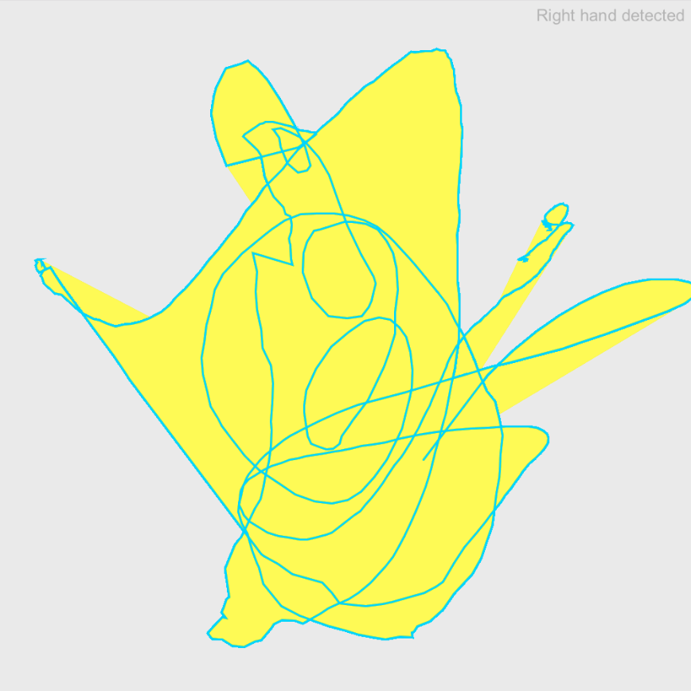
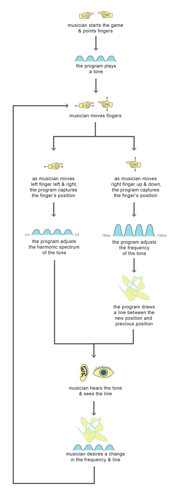

#pseudo theremin 

The pseudo theremin is an experiment in gestural control, audio synthesis and interface design. 

## about the theremin

The theremin is a unique and interesting instrument invented by the Russian inventor and acoustics professor Leon Theremin. Since its invention, the instrument has fascinated and perplexed audiences. The theremin was one of the first electronic synthesizers, but since it is quite difficult to play, and unlike anything familiar like a piano or guitar, it was never fully embraced by the musical community in the way that other synthesizers like the Moog synthesizer were. Instead, it has a cult status and the sound produced by the instrument will be familiar to anyone who's ever seen a horror movie or Pixar's Wall-E. Here are some interesting YouTube compositions:

The theremin is particularly special because the instrument is controlled without physical touch. Instead, it works by turning each of the musician's hands into one "plate" of a capacitor; one hand oscillates the volume of the emitted signal, and the other controls the pitch. 

Diagram Source: <a href="https://en.wikipedia.org/wiki/Theremin">Wikipedia</a>

* <a href="https://www.youtube.com/watch?v=K6KbEnGnymk"">Over the Rainbow</a>
* <a href="https://www.youtube.com/watch?v=PjnaciNT-wQ"">Debussy's Clair de Lune</a>
* <a href="https://www.youtube.com/watch?v=e3im1HUbPjE "">TED: Clara Venice plays the Theremin</a>

## about this prototype

I was drawn to study the use of the Leap Motion gestural controller for this project. Controlling an interface through gesture feels like magic to me, as though conjuring up a spell. Creation in interface through gesture is built with code, and the logic of code is intuitive in the same way as magic can be. And like magic, coding requires dedication and practice to master. In this way, the theremin is quite similar - the gestural control of the instrument feels like magic, but in fact, it relies on the invisible force of electrical current. My goal was to explore the combination of these metaphors (coding as creative/magic) and apply it to a new field for me: audio synthesis. 

<blockquote>The history of music is, in many ways, the history of technology. </blockquote>

I started by researching sound synthesis in Processing through <a href="https://processing.org/tutorials/sound">this Processing tutorial</a>, which begins with the above quote. The tutorial was a fascinating summary of the history of computer-aided music production, a topic I've grown increasingly interested in since reading <a href="https://www.goodreads.com/book/show/37535.Analog_Days">Analog Days: The Invention and Impact of the Moog Synthesizer</a>. 

I experimented with the Minim library and piano samples from freesound.org to create harmonic scales, but ultimately decided to use Processing's Sound library instead. I adapted an example from the above-mentioned Sound tutorial as the baseline for the synthesizer. This example used the mouse position to control the frequency of the emitted sine wave, so my next step was to learn how to extract the positions of the index fingers as detected by the Leap Motion.

Luckily, there is a <a href="https://github.com/nok/leap-motion-processing">Leap Motion for Processing library</a> that comes with a few examples. I also found some other tutorials, cited in the source section below. 

Gestural control is difficult without some sort of visual feedback. In any interface, the user should be able to see where the "cursor"" is. In a touch-less interface, there are more possibilities for what a cursor could look like. Using an ArrayList, I collected the x & y points of the right hand's index finger's positions and used that data to draw a line with a fill. This creates an interesting visualization of the tones produced by the synthesizer. 

Through this prototyping process, I realized that the Leap Motion controller is not 100% reliable, meaning it often mixed up the left and right hands, or failed to detect one or the other. I decided to build a feedback system so the user would be able to see what was going on. I designed functions to display messages on the top of the screen to explain what the Leap Motion was detecting. I also designed a start screen to explain and further brand the experience.

### <a href="comp-media-midterm/comp-media-midterm.pde">View the Processing sketch here.</a>

&nbsp;

## why "pseudo" theremin?

The theremin works based on using hands to capacitate electrical current. One hand controls pitch, while another controls volume. In this game, one hand shifts frequency while the other "detunes" the frequency, or shifts out of harmonic balance. Thus, it didn't feel right to call this a theremin, since it's not exactly right! However, both the real instrument and my approximation call for similar gestural interactions. 

&nbsp;

## cybernetic loops at play

&nbsp;

## what's next? 

There are definitely some technical issues that would improve this project further! For one, further testing of the Leap Motion device and its limitations would help avoid some of the more frustrating errors that interrupt game play. <a href="#limitations">According to Dr. Michael Kipp</a>, there are a few constraints to relying on hands as controls for an interface, including: 

1. Fatigue - it's not comfortable to hold hands in the air for long periods of time
2. Distinguishing meaningful hand movements from non-meaningful
3. Lack of a clickable button

A major resource to work on acquiring would be gaining a greater technical understanding of both coding in Java and using computers to synthesize sound. This would improve the project in meaningful ways including more granular control of the sound output, beyond the scope of introductory tutorials. I could then incorporate more of the functions built in to the Leap Motion controllers, including the pitch, yaw and roll of the hands. This would more accurately replicate the real hand gestures that control the theremin. 

It would also be interesting to move beyond the Leap Motion product, and to use a microcontroller and gestural sensor to build my own controller. Employing other sensors, like a <a href="https://www.sparkfun.com/products/8680">Softpot</a>, could create a more tactile and engaging experience.

Sources: 

* <a id="limitations" href="http://michaelkipp.de/interaction/leap.html">Michael Kipp's Leap tutorial</a>
* <a href="https://github.com/mkipp/LeapInteraction">Leap Interaction</a>
* <a href="https://en.wikipedia.org/wiki/Theremin" />Wikipedia</a>
* <a href="https://www.youtube.com/watch?v=KDG15-iTJLw">The Physics of the Weird and Wonderful Theremin</a>

